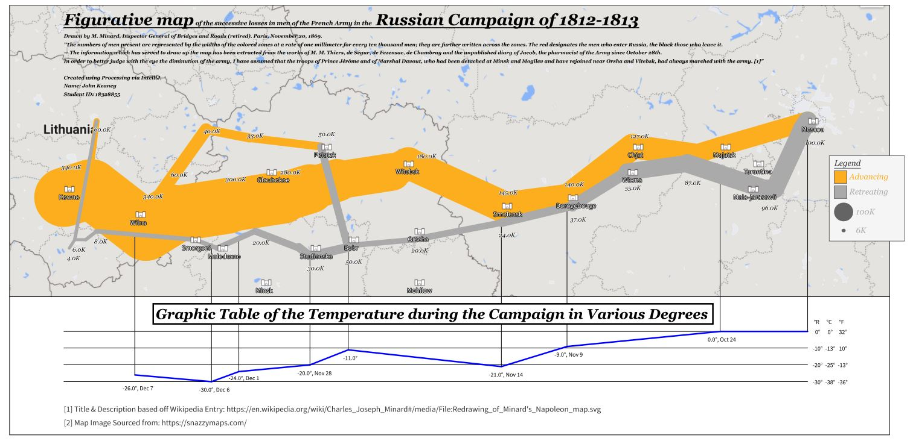

# Minard Map Visualisation

An animation and visualisation of Napoleon’s Campaign to Moscow, Russia from 1812 to 1813, created using Processing (a Java like library). When run, a map and background table are drawn to the 
screen, followed by an animation which draws to screen the path from Kovno to Moscow and back. Using the number of survivors, the stroke weight of the lines is adjusted, making 
the decrease in numbers intuitive to the reader. Paired with this information is the temperature graph, located below the visualisation that showcases the various changes in 
temperatures along the track on the campaigns return. Fort icons are placed wherever a city is located, and a legend detail when the troops were advancing and retreating, along 
with a weight which attempts to showcase the numbers.

[Animated Video Link:] (https://youtu.be/NH7DuoMqsds)

## Important Note:
When viewing the animated .pdf, make sure to use the appropriate browser, otherwise the animated .pdf may only partially load. 
Browsers such as Chrome [as of 28/11/2022] allow for full loading, and animation. Browsers such as Firefox do not.

Here is the final product

